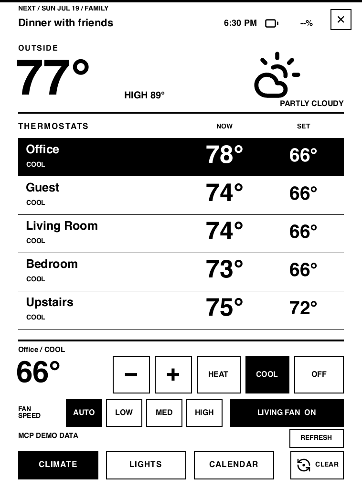

# Ferrink Home Assistant

Ferrink Home Assistant is a native, touch-controlled e-ink dashboard for
jailbroken Kindle devices. It talks directly to a Home Assistant server,
renders with Slint's software renderer, and writes to the Kindle framebuffer
without a browser or web view.

<p align="center">
  
</p>

<p align="center"><sub>Host-rendered Slint demo data captured through the embedded MCP server.</sub></p>

The dashboard includes:

- five thermostat summaries with set-point, HVAC mode, and fan controls;
- twenty light toggles and one independent fan toggle;
- weather, battery, and the next seven calendar events;
- bounded network requests and a two-minute refresh interval;
- a neutral low-distraction sleep screen after inactivity; and
- launch scripts that restore the stock Kindle foreground on exit.

This repository contains the application and the modified Kindle Slint backend
revision it was developed against. It intentionally contains no Home Assistant
credentials, household entity IDs, device screenshots, or personal sleep
image.

## Configure entities

Edit the generic `THERMOSTATS`, `LIGHTS`, and `LIVING_ROOM_FAN` values near the
top of `app/src/main.rs`. Preserve the five-thermostat and twenty-light array
lengths because the current UI is designed around those fixed grids.

Calendar entities are discovered automatically. Weather is read from the first
available Home Assistant weather entity.

## Build

Install the ARM target, Zig, and `cargo-zigbuild`, then build the static Kindle
binary:

```sh
rustup target add armv7-unknown-linux-musleabihf
cargo install cargo-zigbuild
cargo zigbuild --release \
  --target armv7-unknown-linux-musleabihf \
  -p ferrink-home-assistant \
  --locked
```

The artifact is written to:

```text
target/armv7-unknown-linux-musleabihf/release/ferrink-home-assistant
```

## Configure the Kindle

Create `/var/local/ferrink-home-assistant.env` on the Kindle with mode `0600`:

```sh
HASS_URL=http://home-assistant-address:8123
HASS_TOKEN=your-long-lived-access-token
```

You may also set `SLEEP_TIMEOUT_SECS` to a positive number. The default is 600
seconds. Keep the token under `/var/local`; never put it in this repository or
on the USB-visible userstore.

## Install and run

Copy the binary and launcher to `/mnt/us`:

```sh
scp target/armv7-unknown-linux-musleabihf/release/ferrink-home-assistant \
  root@kindle:/mnt/us/
scp launch-ferrink-home-assistant.sh root@kindle:/mnt/us/
ssh root@kindle chmod +x \
  /mnt/us/ferrink-home-assistant \
  /mnt/us/launch-ferrink-home-assistant.sh
```

Run `/mnt/us/launch-ferrink-home-assistant.sh` in the foreground. The launcher
temporarily takes ownership from the stock UI and restores it when the app
exits normally. Kindle foreground replacement is inherently device- and
firmware-sensitive; keep a working SSH connection and a stock recovery path.

For KUAL, copy `kual/ferrink-home-assistant` into the Kindle's `extensions`
directory after installing the binary and launcher above.

## Development

Host tests and formatting checks do not require a Kindle:

```sh
cargo fmt --all -- --check
cargo test --workspace --locked
cargo clippy --workspace --all-targets --locked -- -D warnings
```

Kindle release builds must use `cargo zigbuild`; a host sysroot is not an
equivalent substitute for the target C headers and ABI.

### Slint MCP inspection

Slint 1.17.1 includes an optional embedded MCP server for inspecting the UI,
simulating input, and capturing screenshots. Run the dashboard with built-in
demo data and the headless software renderer like this:

```sh
SLINT_EMIT_DEBUG_INFO=1 \
SLINT_MCP_PORT=9315 \
SLINT_BACKEND=headless-software \
SLINT_DASHBOARD_DEMO=1 \
cargo run -p ferrink-home-assistant --features slint/mcp
```

Connect an MCP client to `http://127.0.0.1:9315/mcp`. Keep `mcp` as a
command-line feature for development; it is not enabled in Kindle release
builds.

## Credits and licensing

The Kindle backend is derived from
[`slint-kindle-backend`](https://github.com/sverrejb/slint-kindle-backend)
and retains its upstream authorship and dual MIT/Apache-2.0 licensing. UI icons
are from Lucide and retain their ISC notice in `app/ui/icons/NOTICE.txt`.

This independent project is not affiliated with or endorsed by Home Assistant,
Nabu Casa, Amazon, or Slint. Product names are used only to describe
compatibility.
